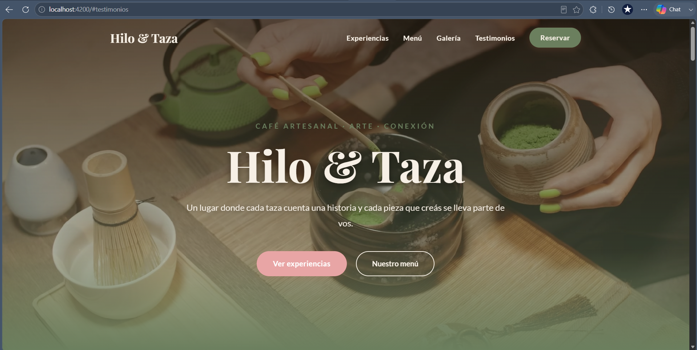
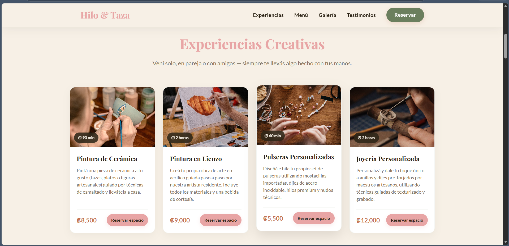
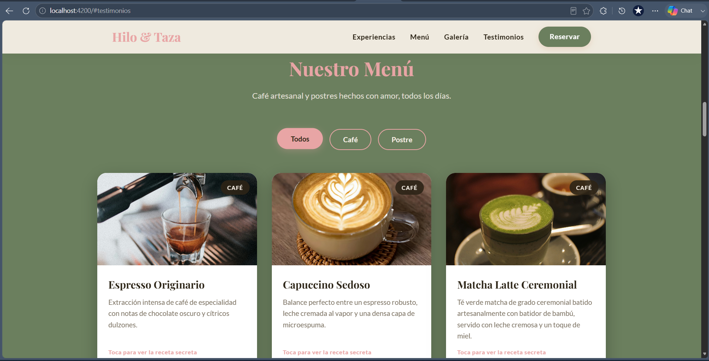
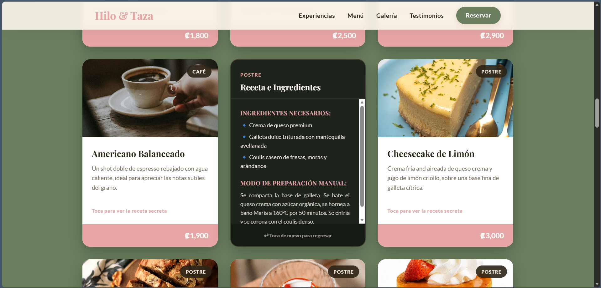
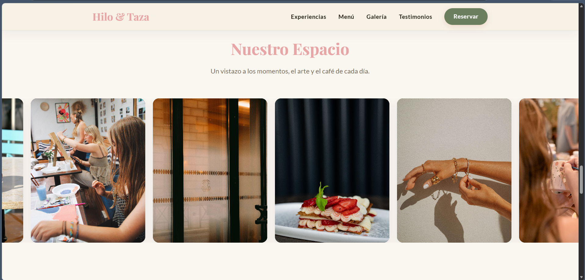
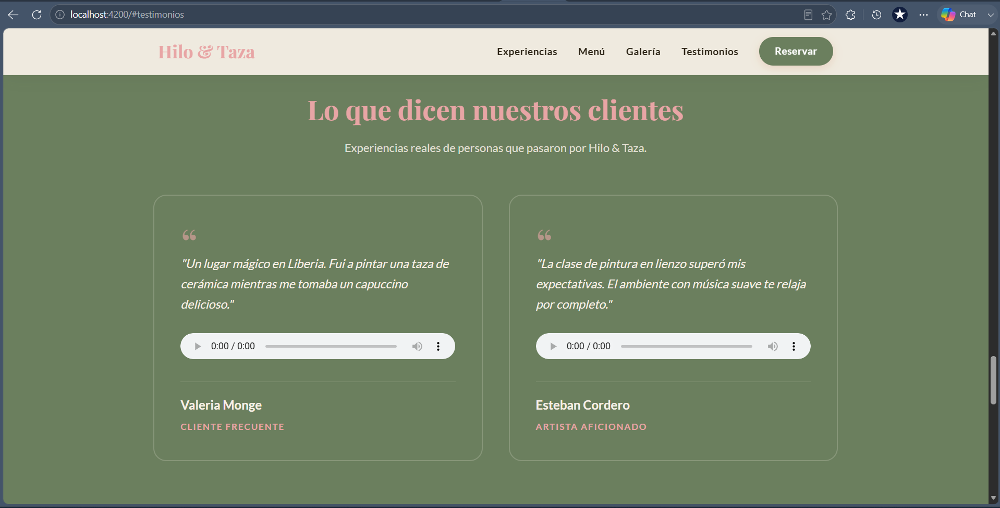
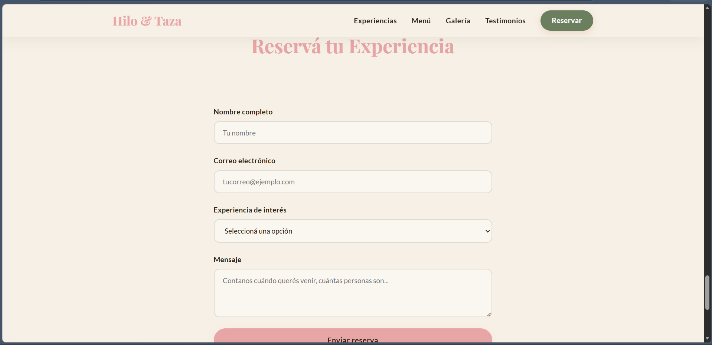
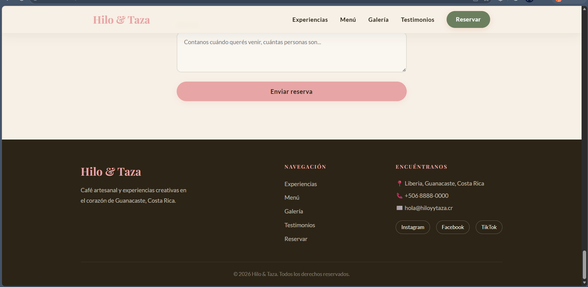

# Hilo & Taza

Proyecto personal del curso IF7102 Multimedios, I Ciclo 2026.  
Aplicación web desarrollada con Angular 19 como framework de JavaScript.

## Descripción

Hilo & Taza es una landing page para una cafetería artesanal ficticia ubicada en Liberia. El concepto combina café de especialidad con experiencias como pintura de cerámica, pintura en lienzo, pulseras personalizadas y joyería artesanal.

## Framework utilizado

**Angular 19** — elegido para aprender su sistema de componentes standalone, binding de datos, directivas estructurales y ciclo de vida de componentes.

## Componentes desarrollados

| Componente    |                  Descripción                              |
|---------------|-----------------------------------------------------------|
|    `Navbar`   |Barra de navegación fija con efecto al hacer scroll        |
|    `Hero`     | Sección principal con video de fondo                      |
| `Experiences` | Tarjetas de experiencias cargadas desde JSON con fetch    |
|    `Menu`     | Menú con filtros por categoría cargado desde JSON         |
|   `Gallery`   | Galería con navegación y lightbox sin librerías externas  |
| `Testimonials`| Testimonios con reproducción de audio                     |
|   `Contact`   | Formulario con validación completa sin librerías externas |
|    `Footer`   | Pie de página con navegación y contacto                   |

## Cómo ejecutar el proyecto

### Requisitos
- Node.js v18 o superior
- Angular CLI instalado globalmente

### Instalación de dependencias

```bash
npm install
```

### Servidor de desarrollo

```bash
ng serve
```

Abrí el navegador en `http://localhost:4200/`. La aplicación se recarga automáticamente al modificar y guardar archivos.


## Capturas de pantalla










## Autora

Yuridia Mendoza Rodríguez — carné: C34880  
IF7102 Multimedios | I Ciclo 2026  
Universidad de Costa Rica, Sede Guanacaste